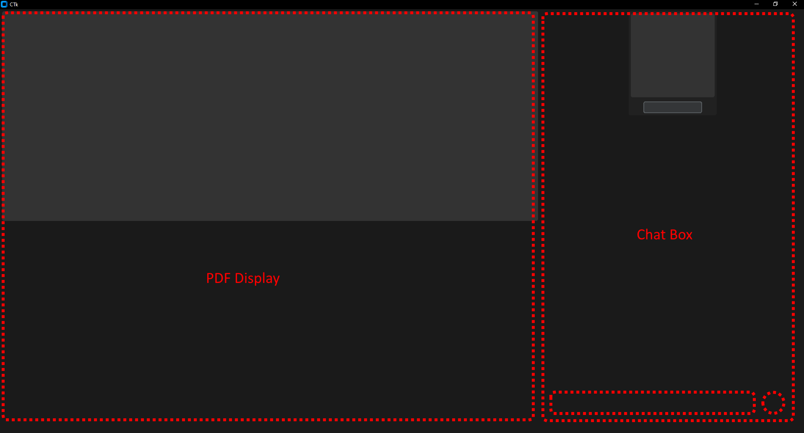

This tool is supposed to resemble a local tool that functions quite similarly to https://www.chatpdf.com/ , so users don't have to upload files to websites to use a tool.

The tool is utilising an LLM on a pdf that helps you find stuff in a pdf and answers questions for you.

UI will be built with *customtkinter*, an extension of the regular *tkinter* that allows for more modern looking interfaces.

The LLM will be built utilizing open source LLMs like *haystack*.

# The User Interface

# Planned Layout

