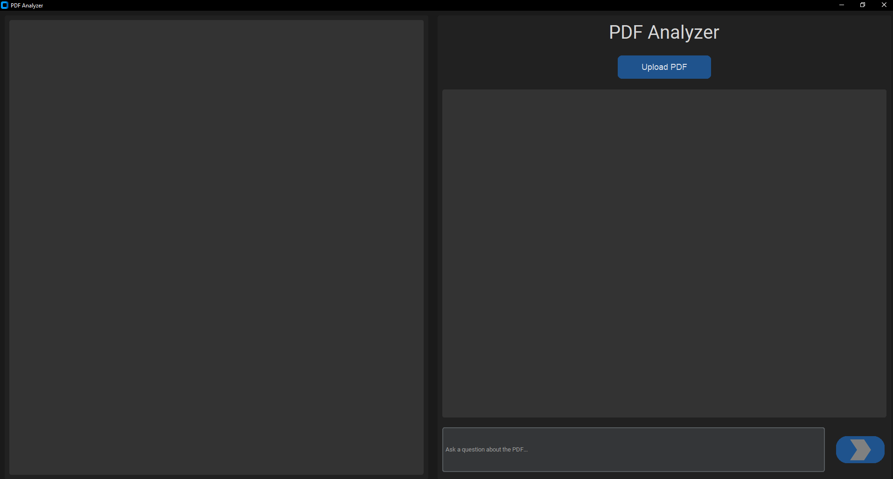

This tool is supposed to resemble a local tool that functions quite similarly to https://www.chatpdf.com/ , so users don't have to upload files to websites to use a tool.

The tool is utilising an LLM on a pdf that helps you find stuff in a pdf and answers questions for you.

To **display the actual PDF file** (not just its text content) within a Tkinter application, we can use an external library like *PyMuPDF* (also known as fitz). This library allows you to render PDF pages as images, which you can then display in your Tkinter application using the *PhotoImage* or *ImageTk.PhotoImage* classes.

UI will be built with *customtkinter*, an extension of the regular *tkinter* that allows for more modern looking interfaces.

The LLM will be built utilizing open source LLMs like *haystack*.

# The User Interface So Far (interface.py)
Rendered PDF is not displayed well currently, and is displayed as image copy of PDF file. Ideally, the PDF is a functional PDF viewer, where text can be highlighted and copied.

# Planned Layout

